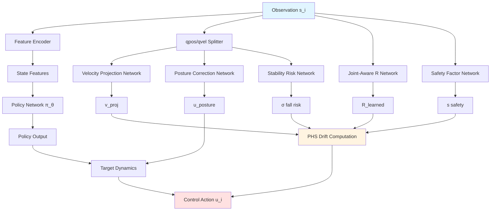
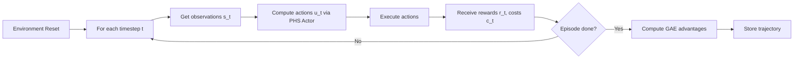

# PHS-MAPPO v2 for Multi-Agent Velocity Tasks

## 📋 Overview

This document describes the **Port-Hamiltonian System (PHS) embedded Multi-Agent PPO** algorithm specialized for multi-agent MuJoCo velocity tasks (e.g., `Safety2x3HalfCheetahVelocity-v0`, `Safety2x4AntVelocity-v0`). The algorithm learns adaptive damping and posture correction to achieve stable, high-speed locomotion while maintaining safety constraints.

---

## 1. Problem Formulation

### 1.1 Task Specification

Multi-agent velocity tasks require coordinated control of a shared robot's joints to maximize forward velocity while maintaining:
- **Safety**: Velocity below environment-specific thresholds
- **Stability**: Upright posture without falling
- **Coordination**: Balanced force distribution across agents

### 1.2 Mathematical Setting

**State Space**: For each agent $i \in \{1, \ldots, n\}$:

$$
\mathbf{s}_i = [\mathbf{q}, \dot{\mathbf{q}}, \text{id}_i] \in \mathbb{R}^{d_s}
$$

where:
- $\mathbf{q} \in \mathbb{R}^{n_q}$: Generalized positions (joint angles, root position)
- $\dot{\mathbf{q}} \in \mathbb{R}^{n_v}$: Generalized velocities
- $\text{id}_i$: One-hot encoded agent ID

**Action Space**: Each agent outputs control torques:

$$
\mathbf{u}_i \in \mathbb{R}^{d_a}, \quad |\mathbf{u}_i| \leq u_{\max}
$$

**Reward Structure**:

$$
r_i = v_{\text{forward}} - \alpha \|\mathbf{u}_i\|^2 - \beta \cdot \mathbb{1}_{\text{unsafe}}
$$

**Cost Signal** (for Lagrangian safety):

$$
c_i = \max(0, \|\dot{\mathbf{q}}\| - v_{\text{threshold}})
$$

---

## 2. Port-Hamiltonian System Architecture

### 2.1 Kinetic Energy Hamiltonian

The system's energy is purely kinetic (no potential energy for velocity tasks):

$$
H(\dot{\mathbf{q}}) = \frac{1}{2} \dot{\mathbf{q}}^\top M \dot{\mathbf{q}}
$$

where $M$ is the generalized mass matrix (assumed identity for simplicity).

**Gradient**:

$$
\nabla_{\dot{\mathbf{q}}} H = M \dot{\mathbf{q}} \approx \dot{\mathbf{q}}
$$

### 2.2 Adaptive Dissipation Matrix

The core innovation is learning a **joint-aware dissipation matrix** $R(\mathbf{s}_i)$:

$$
R(\mathbf{s}_i) = R_0 \mathbf{I} + R_{\text{learned}}(\mathbf{s}_i) \odot \mathbf{M}(\mathbf{s}_i)
$$

where:
- $R_0$: Base damping coefficient (fixed)
- $R_{\text{learned}}(\mathbf{s}_i) \in \mathbb{R}^{d_a}_+$: Learned joint-specific damping (via neural network with Softplus)
- $\mathbf{M}(\mathbf{s}_i)$: Adaptive modulation factor

**Modulation Factor**:

$$
\mathbf{M}(\mathbf{s}_i) = 1 + \gamma_{\text{safety}} \cdot s(\mathbf{s}_i) \cdot \max(0, \|\dot{\mathbf{q}}\| - v_{\text{safe}}) + \gamma_{\text{posture}} \cdot p(\mathbf{s}_i) + \gamma_{\text{stability}} \cdot \sigma(\mathbf{s}_i)
$$

Components:
- $s(\mathbf{s}_i) \in [0,1]$: Learned safety factor
- $p(\mathbf{s}_i) \in \mathbb{R}_+$: Posture deviation risk
- $\sigma(\mathbf{s}_i) \in [0,1]$: Predicted fall risk (via stability network)

### 2.3 PHS Dynamics

The dissipative Hamiltonian dynamics:

$$
\dot{\mathbf{x}} = -R(\mathbf{s}_i) \nabla H + \mathbf{u}_i
$$

Solving for control:

$$
\mathbf{u}_i = \dot{\mathbf{x}}_{\text{target}}(\mathbf{s}_i) + R(\mathbf{s}_i) \mathbf{v}_{\text{proj}}(\dot{\mathbf{q}})
$$

where $\dot{\mathbf{x}}_{\text{target}}$ is the policy output (target velocity change).

---

## 3. Neural Network Architecture



### 3.1 Core Components

#### Feature Encoder
```
Input: s_i ∈ ℝ^{d_s}
→ LayerNorm → Linear(d_s, 256) → ELU
→ Linear(256, 256) → ELU
→ Linear(256, 128) → Output: z_i ∈ ℝ^{128}
```

#### Policy Network π_θ
```
Input: z_i ∈ ℝ^{128}
→ Linear(128, 512) → ELU
→ Linear(512, 256) → ELU
→ Linear(256, d_a) → Tanh → Output: ū_i ∈ [-1, 1]^{d_a}
```

#### Joint-Aware R Network
```
Input: [s_i, v_proj] ∈ ℝ^{d_s + d_a}
→ Linear(d_s+d_a, 256) → LayerNorm → ELU
→ Linear(256, 128) → ELU
→ Linear(128, d_a) → Softplus → Output: R_learned ∈ ℝ^{d_a}_+
```

#### Per-Agent Posture Correction Network
```
Input: [q, agent_id_normalized] ∈ ℝ^{n_q + 1}
→ Linear(n_q+1, 128) → LayerNorm → ELU
→ Linear(128, d_a) → Tanh → Output: u_posture ∈ [-1, 1]^{d_a}
```

#### Stability Risk Network
```
Input: [q, q̇] ∈ ℝ^{n_q + n_v}
→ Linear(n_q+n_v, 64) → ELU
→ Linear(64, 1) → Sigmoid → Output: σ ∈ [0, 1]
```

---

## 4. Multi-Agent Coordination

### 4.1 Agent Communication via Attention

For multi-agent tasks ($n > 1$), agents coordinate through **cross-agent attention**:

$$
\mathbf{c}_i = \text{Attention}(\mathbf{Q}_i, \mathbf{K}_{-i}, \mathbf{V}_{-i})
$$

where:
- Query: $\mathbf{Q}_i = W_Q \mathbf{s}_i$
- Keys: $\mathbf{K}_{-i} = [W_K \mathbf{s}_j]_{j \neq i}$
- Values: $\mathbf{V}_{-i} = [W_V \mathbf{s}_j]_{j \neq i}$

**Attention Weights** (with self-masking):

$$
\alpha_{ij} = \frac{\exp(\mathbf{Q}_i^\top \mathbf{K}_j / \sqrt{d_k})}{\sum_{j \neq i} \exp(\mathbf{Q}_i^\top \mathbf{K}_j / \sqrt{d_k})}
$$

**Coordination Signal**:

$$
\mathbf{u}_{\text{coord},i} = W_O \sum_{j \neq i} \alpha_{ij} \mathbf{V}_j
$$

### 4.2 Combined Control Law

$$
\mathbf{u}_i = \omega_\pi \cdot g(\sigma, p) \cdot \pi_\theta(\mathbf{z}_i) + \omega_c \cdot \mathbf{u}_{\text{coord},i} + \omega_p \cdot \eta(\sigma, p) \cdot \mathbf{u}_{\text{posture},i} + R(\mathbf{s}_i) \mathbf{v}_{\text{proj}}
$$

where:
- $g(\sigma, p) = 1 - \text{clip}(\lambda_g (\sigma + p), 0, 0.8)$: Policy gating (suppress when unstable)
- $\eta(\sigma, p) = \text{clip}(\lambda_\eta (\sigma + p), 0, \eta_{\max})$: Posture correction scaling

---

## 5. Training Algorithm

### 5.1 Data Collection



### 5.2 Policy Update (PPO with Lagrangian Safety)

**Hybrid Advantage**:

$$
\hat{A}^{\text{hybrid}}_t = \hat{A}^r_t - \lambda \hat{A}^c_t
$$

where:
- $\hat{A}^r_t$: Reward advantage (via GAE)
- $\hat{A}^c_t$: Cost advantage
- $\lambda$: Lagrangian multiplier

**Policy Loss** (Clipped PPO):

$$
\mathcal{L}^\pi(\theta) = -\mathbb{E}_t \left[ \min\left( \frac{\pi_\theta(\mathbf{u}_t | \mathbf{s}_t)}{\pi_{\theta_{\text{old}}}(\mathbf{u}_t | \mathbf{s}_t)} \hat{A}^{\text{hybrid}}_t, \; \text{clip}(\rho_t, 1-\epsilon, 1+\epsilon) \hat{A}^{\text{hybrid}}_t \right) \right]
$$

**Lagrangian Multiplier Update** (Dual Ascent):

$$
\lambda_{k+1} = \text{clip}\left( \lambda_k + \eta_\lambda (\bar{c}_{\text{EMA}} - c_{\text{limit}}), \lambda_{\min}, \lambda_{\max} \right)
$$

where $\bar{c}_{\text{EMA}}$ is an exponential moving average of episode costs.

### 5.3 Adaptive Fall Termination

**Height-Based Threshold** (linearly tightened during training):

$$
h_{\text{threshold}}(k) = h_0 \cdot \left(0.7 + 0.3 \cdot \min\left(\frac{k}{k_{\text{warmup}}}, 1\right)\right)
$$

**Pitch Angle Check**:

$$
\theta_{\text{pitch}} = \arcsin(2(w \cdot q_y - z \cdot q_x)), \quad |\theta_{\text{pitch}}| < \theta_{\max}
$$

**Fall Risk** (for monitoring):

$$
\rho_{\text{fall}} = \max\left( \frac{h_{\text{threshold}} - h_{\text{torso}}}{0.15}, \frac{|\theta_{\text{pitch}}| - 0.7\theta_{\max}}{0.3\theta_{\max}} \right)
$$

---

## 6. Algorithm Pseudocode

```python
# Initialization
Initialize actor π_θ (PHS-MAPPO Actor with coordination)
Initialize critics V^r_φ (reward), V^c_ψ (cost)
Initialize shared environment with adaptive fall detection

# Training Loop
for epoch = 1 to N_epochs:
    # Data Collection
    trajectories = []
    for episode = 1 to N_episodes:
        s = env.reset()
        for t = 1 to T_max:
            # Compute PHS control
            z = FeatureEncoder(s)
            q, q̇ = split_state(s)
            
            # Multi-agent coordination
            if n_agents > 1:
                u_coord = CrossAgentAttention({s_i})
            
            # Posture and stability
            σ = StabilityRisk(q, q̇)
            u_posture = PostureCorrection(q, agent_id)
            
            # Policy output
            ū = π_θ(z)
            
            # PHS drift
            R = R_0 + R_learned(s) * Modulation(s, σ)
            drift = R * VelocityProjection(q̇)
            
            # Final action
            u = ū * gate(σ) + u_coord + u_posture * scale(σ) + drift
            
            # Execute
            s_next, r, c, done, info = env.step(u)
            fall_risk = info['fall_risk']
            
            trajectories.append((s, u, r, c, s_next, done, fall_risk))
            s = s_next
            
            if done: break
    
    # Advantage Estimation
    for traj in trajectories:
        A^r = compute_gae_reward(traj, V^r_φ)
        A^c = compute_gae_cost(traj, V^c_ψ)
        A^hybrid = A^r - λ * A^c
    
    # Policy Update
    for _ in range(K_ppo_epochs):
        L_π = -E[min(ρ * A^hybrid, clip(ρ) * A^hybrid)]
        θ ← Adam(∇_θ L_π)
    
    # Critic Updates
    L_V^r = E[(V^r_φ(s) - R)^2]
    L_V^c = E[(V^c_ψ(s) - C)^2]
    φ ← Adam(∇_φ L_V^r)
    ψ ← Adam(∇_ψ L_V^c)
    
    # Lagrangian Update
    λ ← clip(λ + η_λ * (c_EMA - c_limit), λ_min, λ_max)
```

---

## 7. Monitoring Metrics

### 7.1 Performance Metrics

| Metric | Description | Target Range |
|--------|-------------|--------------|
| `Velocity/x_velocity` | Forward velocity | > 2.0 m/s |
| `Velocity/velocity_ratio` | Safe velocity ratio | > 0.8 |
| `Episode/reward_mean` | Average episode reward | Increasing |
| `Episode/length_mean` | Episode duration | > 500 steps |

### 7.2 Safety Metrics

| Metric | Description | Target Range |
|--------|-------------|--------------|
| `Safe/lamda_lagr` | Lagrangian multiplier | 0.5 - 5.0 |
| `Safe/cost_violation` | Cost constraint violation | < 0.0 |
| `Safe/fall_risk_mean` | Average fall risk | < 0.3 |
| `Safe/stability_risk_mean` | Predicted fall risk | < 0.4 |

### 7.3 PHS-Specific Metrics

| Metric | Description | Target Range |
|--------|-------------|--------------|
| `PHS/R_total_mean` | Total damping | 0.3 - 2.0 |
| `PHS/R_learned_mean` | Learned damping | 0.1 - 1.0 |
| `PHS/posture_risk_mean` | Posture deviation | < 0.5 |
| `PHS/coordination_signal_mean` | Agent coordination strength | 0.1 - 0.5 |

---

## 8. Practical Recommendations

### 8.1 Hyperparameter Tuning

**For HalfCheetah (2x3, 6x1)**:
```python
velocity_r_base = 0.15              # Higher damping for stability
velocity_posture_threshold = 0.30    # Stricter posture tolerance
fall_height_threshold = 0.35         # Allow some crouch
adaptive_fall_threshold = True       # Gradual tightening
```

**For Ant (2x4, 4x2)**:
```python
velocity_r_base = 0.12              # More freedom for legs
velocity_posture_threshold = 0.40    # More lenient posture
fall_height_threshold = 0.28         # Stricter height (prone to collapse)
coordination_weight = 0.4            # Strong inter-agent coordination
```

### 8.2 Common Issues & Solutions

| Issue | Root Cause | Solution |
|-------|-----------|----------|
| Agents fall during early training | Insufficient initial damping | Increase `velocity_r_base` to 0.2 |
| Posterior limbs over-actuate (HalfCheetah) | Weak coordination | Increase `coordination_weight`, add per-agent posture correction |
| Reward plateaus with negative values | Over-conservative policy | Reduce `velocity_posture_gate`, increase exploration noise |
| Agent "crawls" instead of running | Fall threshold too strict | Enable `adaptive_fall_threshold`, start with higher threshold |

---

## 9. References

1. **Port-Hamiltonian Systems**: van der Schaft, A., & Jeltsema, D. (2014). *Port-Hamiltonian Systems Theory: An Introductory Overview*.
2. **MAPPO**: Yu, C., et al. (2022). *The Surprising Effectiveness of PPO in Cooperative Multi-Agent Games*. NeurIPS.
3. **Lagrangian Safety**: Ray, A., et al. (2019). *Benchmarking Safe Exploration in Deep Reinforcement Learning*. AI Safety.
4. **MuJoCo Multi-Agent**: Peng, X. B., et al. (2021). *AMP: Adversarial Motion Priors for Stylized Physics-Based Character Control*. SIGGRAPH.

---

## Appendix: Notation Table

| Symbol | Description | Dimension |
|--------|-------------|-----------|
| $\mathbf{s}_i$ | State observation for agent $i$ | $\mathbb{R}^{d_s}$ |
| $\mathbf{q}$ | Generalized positions (joint angles) | $\mathbb{R}^{n_q}$ |
| $\dot{\mathbf{q}}$ | Generalized velocities | $\mathbb{R}^{n_v}$ |
| $\mathbf{u}_i$ | Control action for agent $i$ | $\mathbb{R}^{d_a}$ |
| $H$ | Hamiltonian (kinetic energy) | $\mathbb{R}$ |
| $R(\mathbf{s}_i)$ | Adaptive dissipation matrix | $\mathbb{R}^{d_a \times d_a}$ |
| $\pi_\theta$ | Policy network with parameters $\theta$ | $\mathbb{R}^{d_s} \to \mathbb{R}^{d_a}$ |
| $\lambda$ | Lagrangian multiplier (safety) | $\mathbb{R}_+$ |
| $\sigma(\mathbf{s}_i)$ | Predicted fall risk | $[0, 1]$ |
